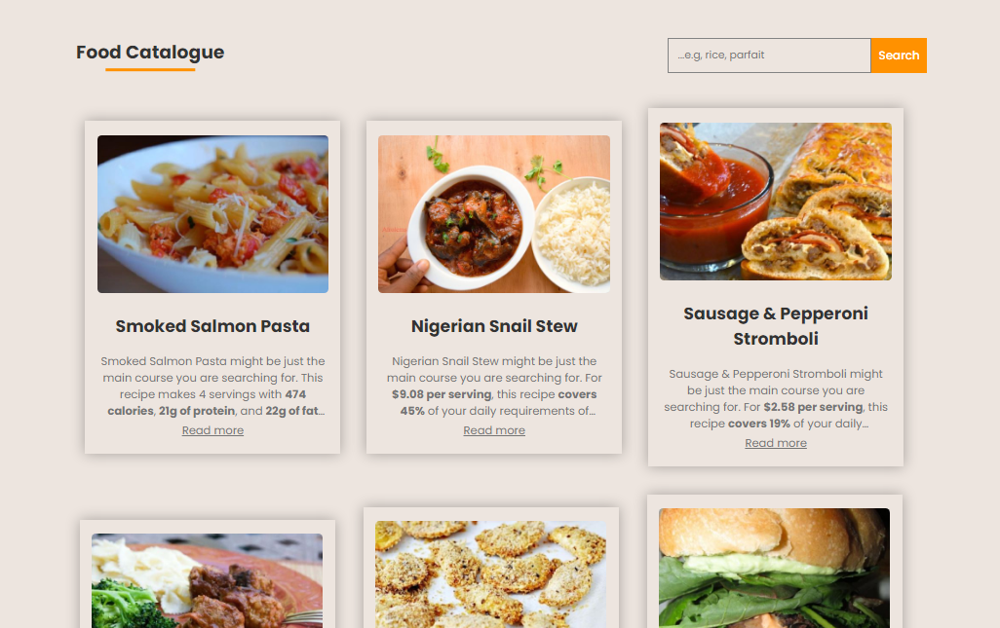
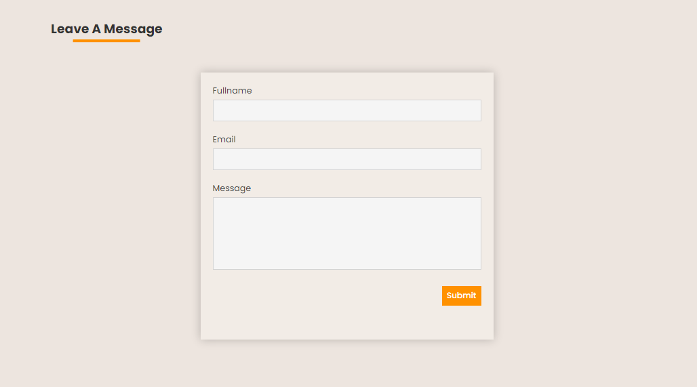

# Introduction

Here is a website that generates food items, including their name, image, description and recipes. This project is inspired by [Spoonacular API](https://spoonacular.com/food-api)

---

## Features

- Fully responsive for mobile, tablets and desktop.

- Displays random food items including their name, image, description and recipes.

- Has a search functionality where you can search for food item(s) of your choice.

- Has a section for receiving feedback/reviews.

---

## Technologies

- HTML
- CSS
- JavaScript

---

## Links

Below are useful links related to this project:

[Live Preview](https://foodie110.netlify.app/)

[API](https://spoonacular.com/food-api)

---

### 1. Navbar & Banner

---

---

### 2. Food Catalogue

---

### 3. Review / Feedbacks

